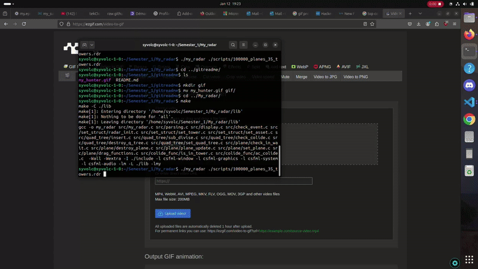

<span style="color:orange; font-size:20em;">
    <h1 align="center">
        <br>
            My Radar
        <br>
    </h1>
</span>

<div align="center">
    
</div>
## Subject:

* My_radar is a simulation of a fly map where planes have: 
    * a depature position.
    * a end position.
    * a speed.
    * a time of spawn.
* there is towers on the map where when planes are in one of those tower the planes can't colides
* planes are distruct when they:
    * when they inter collide.
    * when they arrived at there end position.
* all the information of the plane and towers are in a txt file (there is already test file in the scripts directory)
* the green rectangle that you can see on the preview is an opstimisation method to manage a lot of entity collision by cut the screen in different part to compare less planes with each other

## How To Use

To clone and run this application, you'll need [Git](https://git-scm.com) and [CSFML](https://terminalroot.com/install-csfml-sfml-for-c-language/). Next you can execute these commands to test the project.
```bash
#clone this repository
gitclone git@github.com:tekClovis/My_radar.git My_radar

#go in the repository
cd My_radar

#compil the project
make

#execute the binary you can use "-h" flag for more use information
./my_radar [path]
```
you can create your own scripts with the generator.py whith these command
```bash
python3 generator.py -p (numb of plane) -t (number of tower)
#for more option use the -h flag like that
python3 generator.py -h
```
